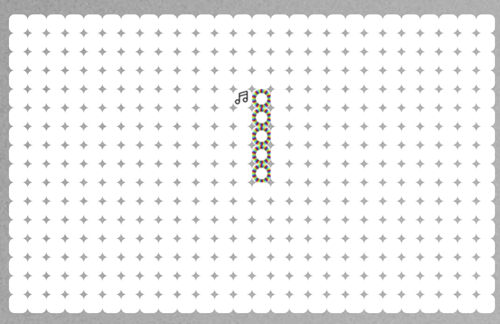
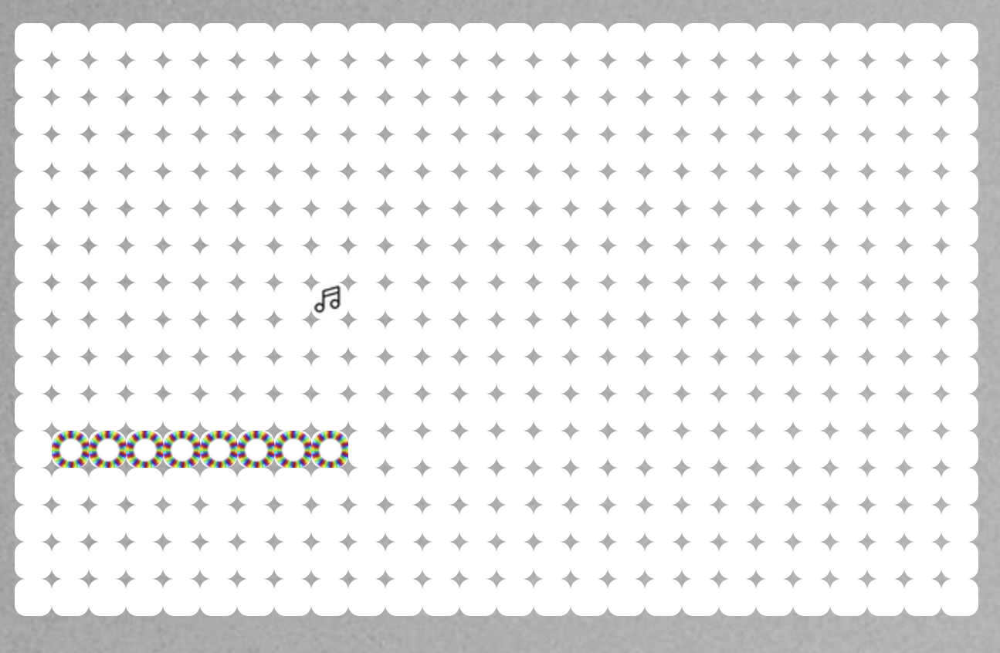
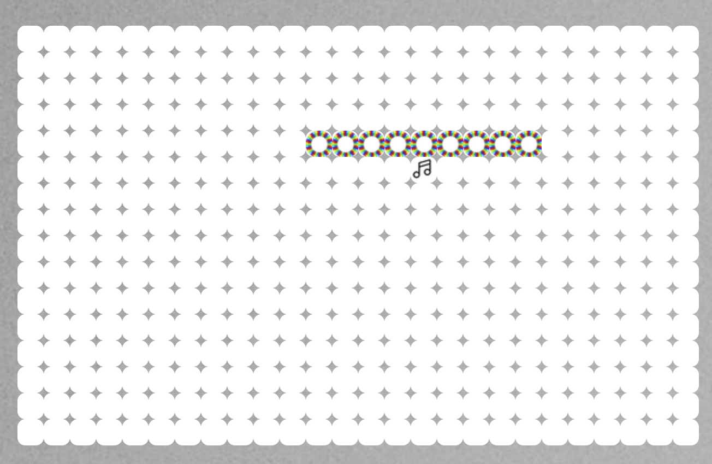
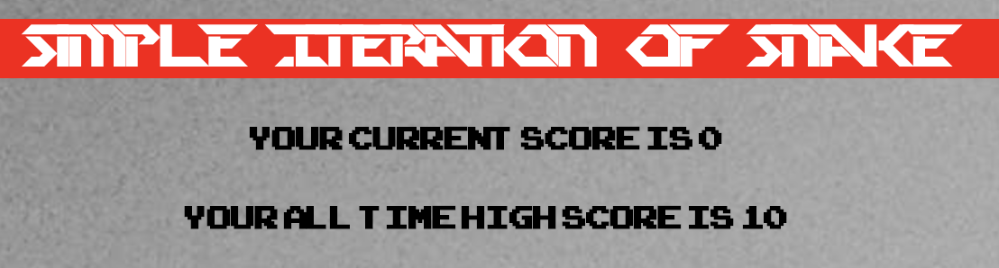

# SEI - Project One 
This is the first project that I have built for our software engineering immersive at General Assembly.

---

# Music Inspired Basic Snake Game

This project is a browser-based version of the classic game Snake , built using pure Javascript. No external libraries or HTML5.

## Built With

1. HTML
2. CSS
3. Javascript

## Deployment

The game is deployed on GitHub Pages and it can be found here: https://Kirmaan.github.io/project-01/

## Game Mechanics

The main objective of this game is to feed a virtual snake with food particles which are found at random positions causing the speed of the game to increase and the length of the snake to increase.

My version of snake has been slightly modified so that the snake is a ring of piano keys & that the food particles are Musical notes.

## Added Extra Features

I decided to build in a score feauture that tells the player the current amount of pieces of food that have been eaten. So to make it easier for myself I just refrenced the 'snakeLength' variable I created which increases based on the amount of food eaten.

I also built in a high-score feauture using the localStorage API.

## Future improvements

I would like to add in the feauture of having the snake pass through the walls and come out on the other side instead of dying and having the game restart. I would also like to make the game more responsive in terms of mobile devices.

The plan is to also add in a button which resets the entire game , including high score. I would also like to add in a leaderboard with the top five players scores.

I would potentially also work on adding in a AI snake which chases the randomly placed food object. Making it much harder for you to grow.

## Author

Kirmaan Aboobaker - http://github.com/Kirmaan

